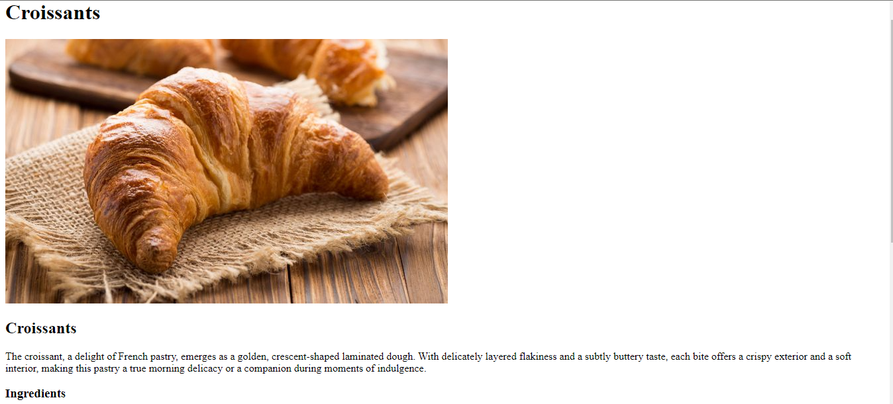

# Recipes Page
This is the [Project Recipes](https://www.theodinproject.com/lessons/foundations-recipes) exercise of the Odin Project curriculum.

## Demo

Insert gif or link to demo

## PC View:

## What I learned is

- to use the lists in orderly and disorderly fashion
- index creation
- GIT commands
- creating links and boilerplate
